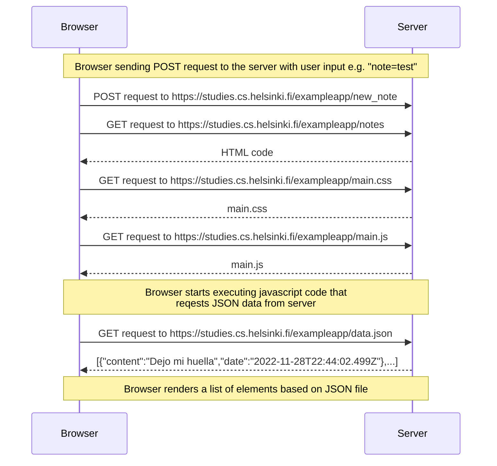

```mermaid
    sequenceDiagram
    Note over Browser, Server: Browser sending POST request to the server with user input e.g. "note=test"
    Browser->>Server: POST request to https://studies.cs.helsinki.fi/exampleapp/new_note
    Browser->>Server: GET request to https://studies.cs.helsinki.fi/exampleapp/notes
    Server-->>Browser: HTML code
    Browser->>Server: GET request to https://studies.cs.helsinki.fi/exampleapp/main.css
    Server-->>Browser: main.css
    Browser->>Server: GET request to https://studies.cs.helsinki.fi/exampleapp/main.js
    Server-->>Browser: main.js
    Note over Browser, Server: Browser starts executing javascript code that<br> reqests JSON data from server
    Browser->>Server: GET request to https://studies.cs.helsinki.fi/exampleapp/data.json
    Server-->>Browser: [{"content":"Dejo mi huella","date":"2022-11-28T22:44:02.499Z"},...]
    Note over Browser, Server: Browser renders a list of elements based on JSON file
```
