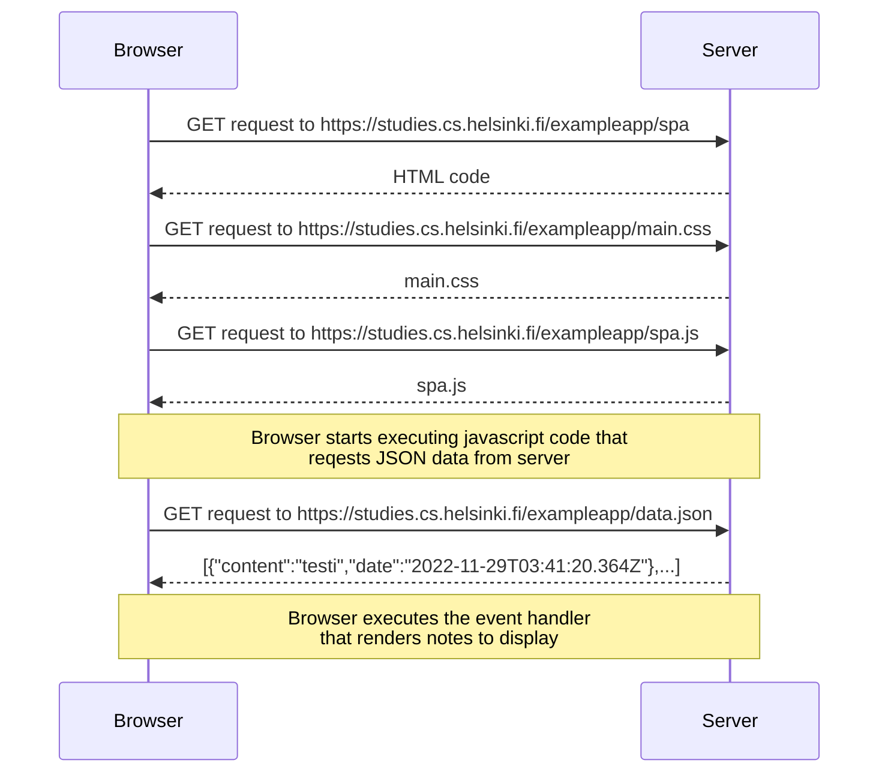

```mermaid
    sequenceDiagram
    Browser->>Server: GET request to https://studies.cs.helsinki.fi/exampleapp/spa
    Server-->>Browser: HTML code
    Browser->>Server: GET request to https://studies.cs.helsinki.fi/exampleapp/main.css
    Server-->>Browser: main.css
    Browser->>Server: GET request to https://studies.cs.helsinki.fi/exampleapp/spa.js
    Server-->>Browser: spa.js
    Note over Browser, Server: Browser starts executing javascript code that<br> reqests JSON data from server
    Browser->>Server: GET request to https://studies.cs.helsinki.fi/exampleapp/data.json
    Server-->>Browser: [{"content":"testi","date":"2022-11-29T03:41:20.364Z"},...]
    Note over Browser, Server: Browser executes the event handler<br>that renders notes to display
```
