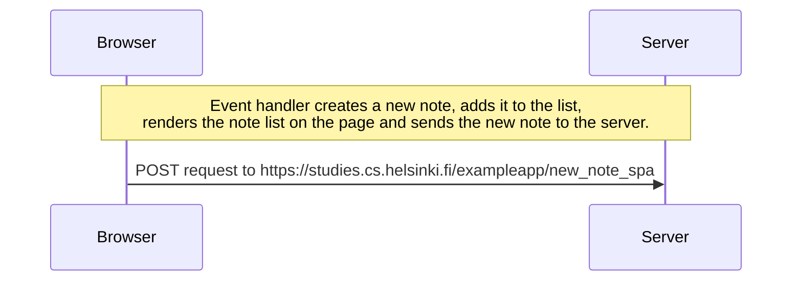

```mermaid
    sequenceDiagram
    Note over Browser, Server: Event handler creates a new note, adds it to the list,<br> renders the note list on the page and sends the new note to the server.
    Browser->>Server: POST request to https://studies.cs.helsinki.fi/exampleapp/new_note_spa
```
